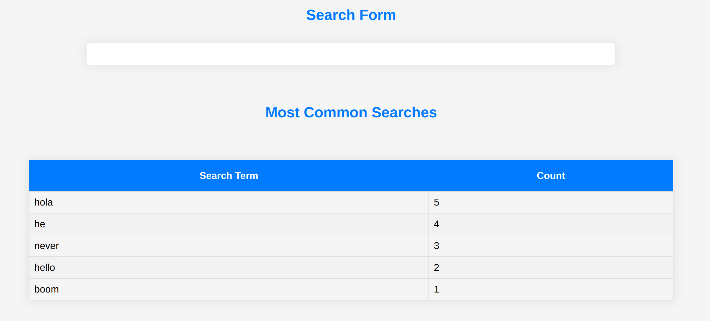
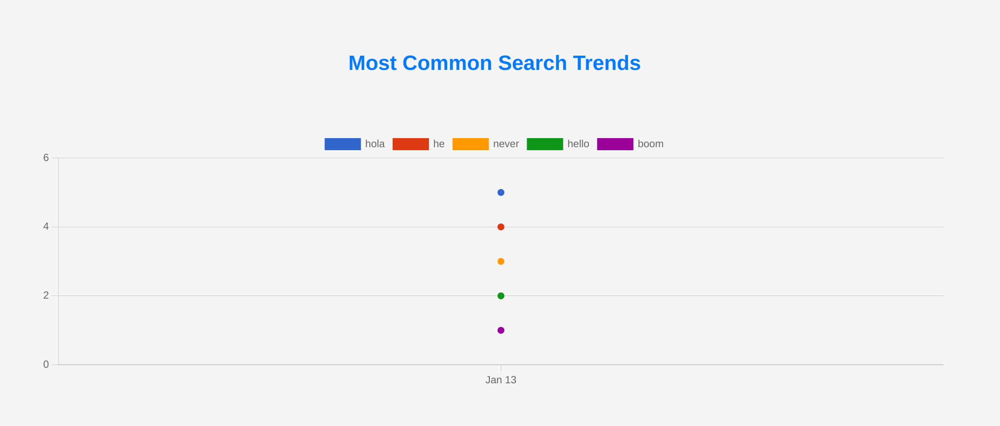

# Portfolio

>This is a search engine where we save the search terms entered by users, based on their IP addresses, and then perform analytics on these searches

## Screen shots

 
 

## Built With
- 
- 
- 
- 
- 
- 

## Live Demo (if available)

[Live Demo Link](https://search-engine-477b674c37d7.herokuapp.com/)

## Authors

👤 **Terbeche Mostefa**

- GitHub: [@githubhandle](https://github.com/Terbeche)
- LinkedIn: [LinkedIn](https://www.linkedin.com/in/mustapha-terbeche/)

## Setup

If you wish to run the project locally, please do the following:

1.- Clone the repository to your local machine. - **`git clone https://github.com/Terbeche/search-engine.git`** - **`cd search-engine`**

2.- Make sure you have Ruby, Rails, and Bundler installed on your machine. If not, you can follow the instructions on the Ruby on Rails Guide..

3.- Install the necessary gems by running the following command in your terminal:

```bash
bundle install
```

4.- Set up the database:

rails db:create
rails db:migrate

5.- Once you have the setup and the project locally, you can run the project using the following command in your terminal:

rails server

This will start the Rails server and you can access your application by navigating to http://localhost:3000 in your web browser.

6.- If you want to see any changes you make to the code reflected live, you just need to save your changes and refresh your browser. The Rails server automatically picks up changes in the development environment. 😊

## 🤝 Contributing

Contributions, issues, and feature requests are welcome!

Feel free to check the [issues page](https://github.com/Terbeche/search-engine/issues).

## Show your support

Give a ⭐️ if you like this project!

